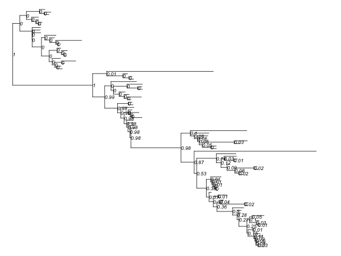
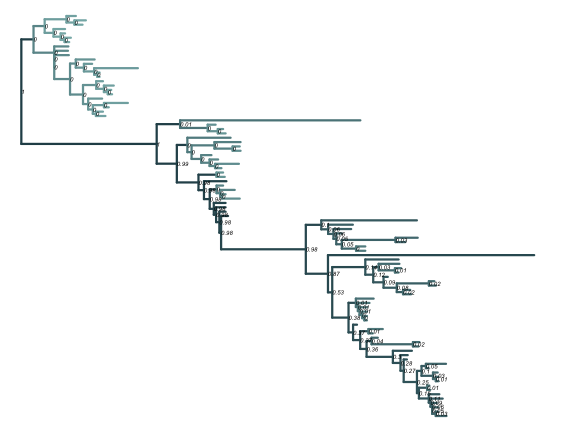
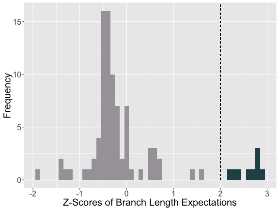
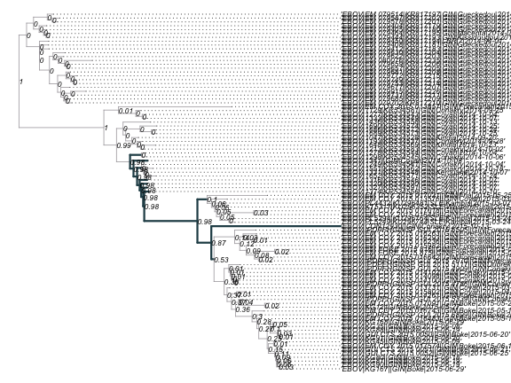
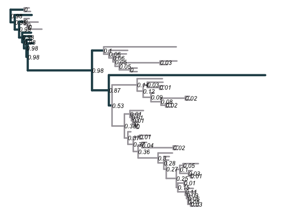
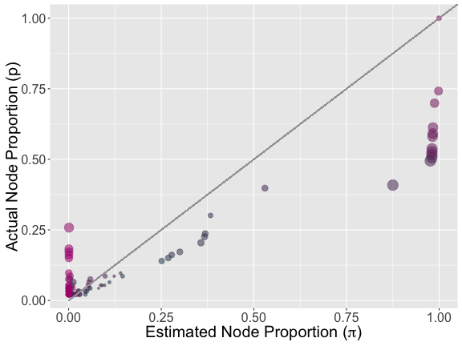
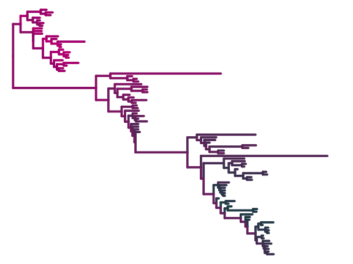

*R code in Ebola_Tree.Rmd*

## Overview

This uses data from the Ebola Sequence Consortium to demonstrate the methodology introduced in `Node_Prob_Functions`, quantifying proportion of samples expected under internal nodes. Includes visualizations of the labeled Ebola tree as well as calculation and visualization of  Z-scores measuring the difference between proportion of tips seen versus expected under a node. Z-scores serve as a metric for whether a node is predicted to be undersampled. Requires methods from `Node_Prob_Functions` and the Conakry Ebola subtree file [`EBOV_Conakry_subtree.tree`](EBOV_Conakry_subtree.tree) to run.

The Ebola subtree of the Conakry lineage was extracted from the BEAST analysis conducted by [Dudas et al. 2016](https://github.com/ebov/space-time).


## Load libraries and unsampled functions

```r
source('../functions/Node_Prob_Functions.R')
par(mar=c(0,0,0,0))
```

## Formatting the full ebola tree data and calculating node probabilities

```r
#Ebola Data

#With Jitter, Population size of 1
ebola <- read.nexus(file="EBOV_Conakry_subtree.tree")
set.seed(7)
ebola$edge.length <- jitter(ebola$edge.length)
popsize=1

#Full Ebola Tree
e <- subtrees(ebola)
ebola.pr <- matrix(NA, nrow=length(e), ncol = 3)
colnames(ebola.pr) <- c("Node.Pr", "N.Tips", "ZScore")

for(i in 1:length(e)){
  ebola.pr[i,1] <- nu.node.prob(ebola, e[[i]], 1)
  ebola.pr[i,2] <- length(e[[i]]$tip.label)
}

#Calculating Z-Scores
for(i in 1:length(ebola.pr[,3])){
  ebola.pr[i,3] <- ebola.pr[i,1]*93-ebola.pr[i,2]
}
ebola.pr[,3] <- scale(ebola.pr[,3])
```

## Visualizing the tree with node probabilities

```r
ebola2 <- ebola
ebola2$node.label <- round(ebola.pr[,1], digits=2)
plot(ebola2, show.node.label = TRUE, cex=.7, show.tip.label=FALSE)
```



```r
#plotting the full ebola tree colored by node probabilities
pr.palatte <- colorRampPalette(colors= c("#8bb9b9", "#284e57"))(92)
pr.tree <- rep(0, 92*2)
pr.cols <- order(ebola.pr[,1]) + 93
for(i in 1:length(pr.cols)){
  indicies <- which(ebola$edge[,1]==pr.cols[i])
  pr.tree[indicies[1]] <- pr.palatte[i]
  pr.tree[indicies[2]] <- pr.palatte[i]
}
plot(ebola2, show.tip.label=FALSE, edge.color=pr.tree, edge.width=3, show.node.label=TRUE, cex=0.5)
```



## Visualizing outliers by Z-scores in the full tree

```r
#Visualizing z scors and outliers with histogram in ggplot
zs <- as.data.frame(ebola.pr)
zs$outlier <- ifelse(abs(zs[,3]>2),TRUE, FALSE)
cols <- c("#a6a2a8","#284e57")
ggplot(data=zs, aes(zs$ZScore, fill=zs$outlier)) + 
  geom_histogram(binwidth=.1) + 
  xlab("Z-Scores of Branch Length Expectations") +
  ylab("Frequency") +
  theme(legend.position="none") + 
  scale_fill_manual(values= cols) + 
  geom_segment(x=2, y= 0, yend=20, xend=2, linetype=2)+
  theme(legend.position="none", axis.text=element_text(size=16), axis.title = element_text(size=20))
```



## Visualizing outliers on the tree

```r
#With tip labels
t.col <- ifelse(ebola$edge[,1] <= 105 & ebola$edge[,1] >= 97, "#284e57", "#a6a2a8")
wid <-ifelse(ebola$edge[,1] <= 105 & ebola$edge[,1] >= 97, 3, 1)
plot(ebola2, show.node.label = TRUE, cex=.7, align.tip.label=TRUE, edge.color=t.col, edge.width=wid)
```



```r
#Without tip labels
t.col2 <-ifelse(e[[4]]$edge[,1] <= 66 & e[[4]]$edge[,1] >= 58, "#284e57", "#a6a2a8")
wid2 <-ifelse(e[[4]]$edge[,1] <= 66 & e[[4]]$edge[,1] >= 58, 3, 1)
subt <- extract.clade(ebola2, 97)
plot(subt, cex=1, show.tip.label=FALSE, edge.color=t.col2, edge.width=wid2+3, show.node.label=TRUE)
```



## Node probabilities plotted against tips within the clades

```r
zs$i <- as.factor(dist.nodes(ebola)[1,94:185])
#colrs <- colorRampPalette(brewer.pal(11,"PiYG"))(92)
colrs <- colorRampPalette(colors =c("#284e57", "mediumvioletred"))(92)

#Scatterplot of estimated versus actual node proportions
ggplot(data=zs, (aes(x=Node.Pr, y=N.Tips/93))) + 
  geom_point(aes(size=abs(ZScore), alpha=.8, color=i)) + 
  xlab(expression(paste("Estimated Node Proportion (", pi, ")"))) +
  ylab(paste("Actual Node Proportion (p)")) +
  geom_segment(x=0.0, y=0, xend=1.2, yend=1.2, linetype=1, color="#a6a2a8") +
  theme(legend.position="none", axis.text=element_text(size=16), axis.title = element_text(size=20)) +
  scale_color_manual(values=colrs)
```



## Coloring the full ebola tree by the clades in the scatterplot above

```r
x <-zs$i
colmap <- as.data.frame(cbind(x, 1:92))
treecol <- rep(0, 92)
for(i in 1:92){
  treecol[i] <- colrs[colmap[i,1]]
}
treecol <- rep(treecol, each=2)
plot(ebola2, show.tip.label=FALSE, edge.color=treecol, edge.width=5)
```


