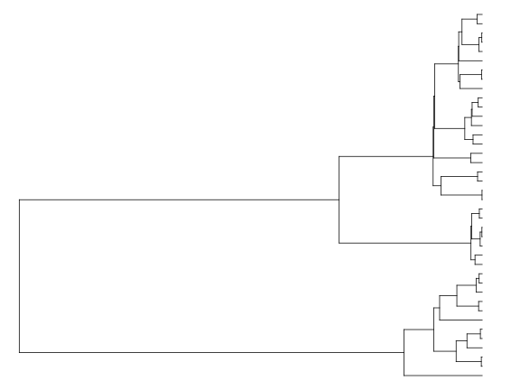
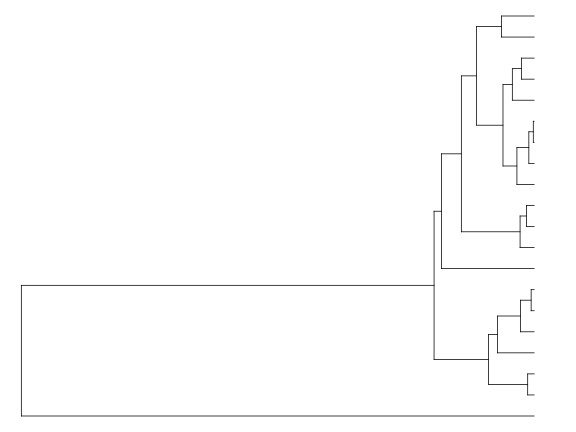
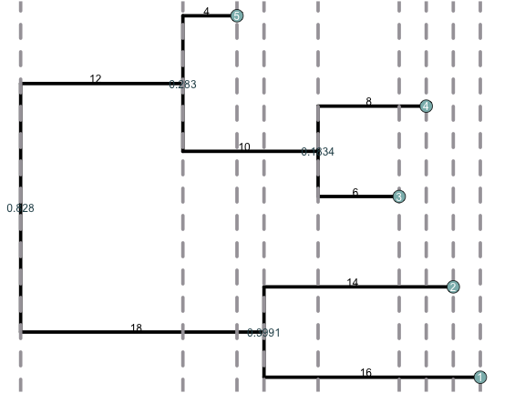

*R code in [`Toy_Tree.Rmd`](Toy_Tree.Rmd)*


## Load libraries and unsampled functions

```r
source('../functions/Node_Prob_Functions.R')
par(mar=c(0,0,0,0))
```

## Stereotypical Coalescent Structure

```r
set.seed(10)
t <- create.phylo(40, 2000)
plot(t, show.tip.label=FALSE)
```



```r
u <- create.phylo(20, 2000)
plot(u, show.tip.label=FALSE)
```



## Toy Tree

```r
edge = matrix(c(6,7, 7,1, 7,2, 6,8, 8,9, 9,3, 9,4, 8,5), nrow=8, ncol=2, byrow=TRUE)
edge.length <- c(18, 16, 14, 12, 10, 6, 8, 4)
tip.label <-c("1", "2", "3", "4", "5")
Nnode=4
t <- list(edge=edge, edge.length=edge.length, tip.label = tip.label, Nnode = Nnode)
class(t) <- "phylo"
```

## Node probabilities for the toy tree

```r
node.pr <- rep(0,4)
for(i in 1:4){
  node.pr[i] <- nu.node.prob(t, subtrees(t)[[i]], 50)
}
```

## Plotting toy tree with interval divisions

```r
par(mar=c(0.1,0.1,0.1,0.1))
plot(t, edge.width=5)
lines(c(34,34), c(0,15), lty=2, lwd=5, col ="#a6a2a8")
lines(c(32,32), c(0,15), lty=2, lwd=5, col ="#a6a2a8")
lines(c(30,30), c(0,15), lty=2, lwd=5, col ="#a6a2a8")
lines(c(28,28), c(0,15), lty=2, lwd=5, col ="#a6a2a8")
lines(c(22,22), c(0,15), lty=2, lwd=5, col ="#a6a2a8")
lines(c(18,18), c(0,15), lty=2, lwd=5, col ="#a6a2a8")
lines(c(16,16), c(0,15), lty=2, lwd=5, col ="#a6a2a8")
lines(c(12,12), c(0,15), lty=2, lwd=5, col ="#a6a2a8") 
lines(c(0,0), c(0,15), lty=2, lwd=5, col="#a6a2a8") 
nodelabels(text = round(node.pr, 4), frame="none", col="#284e57", cex=1)
tiplabels(text=t$tip.label, frame="circle", bg="#8bb9b9", col="white", cex= 1)
edgelabels(text=t$edge.length, frame="none", adj=c(1,-.1), cex= 1)
```


